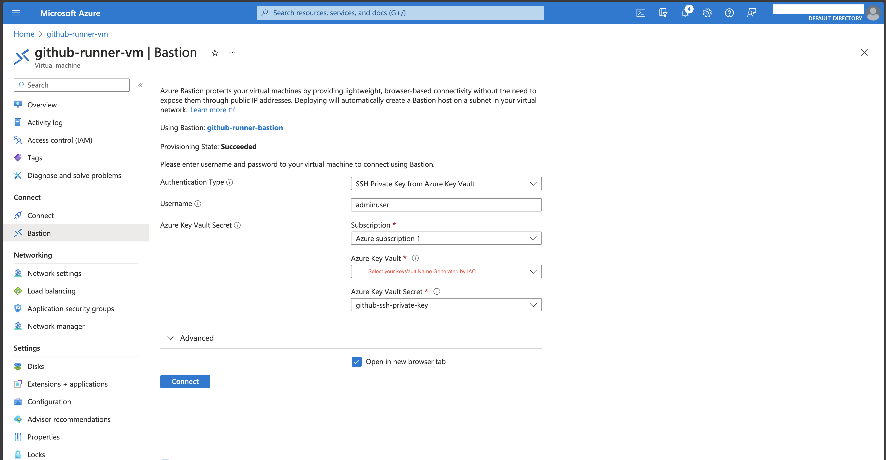

# How to configure the github runner VM

1. Login into the vm using the created [bastion](https://learn.microsoft.com/en-us/azure/bastion/bastion-overview)  
    1. In azure portal search for `github-runner-vm` 
    1. In the left pane  under Connect -> `bastion` 



# After the vm was created

1. install az cli: `curl -sL https://aka.ms/InstallAzureCLIDeb | sudo bash`
1. install [github runner](https://docs.github.com/en/actions/hosting-your-own-runners/managing-self-hosted-runners/about-self-hosted-runners) [Github how to guide](https://docs.github.com/en/actions/hosting-your-own-runners/managing-self-hosted-runners/adding-self-hosted-runners)
1. Setup MSI : `az login --identity --allow-no-subscriptions`
1. Install Kubectl:  
```
curl -LO "https://storage.googleapis.com/kubernetes-release/release/$(curl -s https://storage.googleapis.com/kubernetes-release/release/stable.txt)/bin/linux/amd64/kubectl"
chmod +x ./kubectl
sudo mv ./kubectl /usr/local/bin/kubectl
```